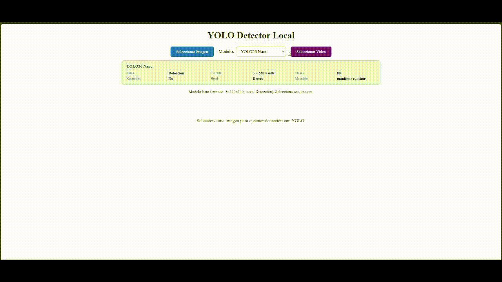

# VidAnalytics

Detector de objetos YOLO que se ejecuta completamente en el navegador usando **LiteRT.js** (Google's on-device AI runtime). No se envía nada a ningún servidor — todo corre localmente con aceleración WASM/WebGPU.



## Cómo usar

```bash
ng serve
```

1. Espera a que cargue el modelo (`yolo26n.tflite`)
2. Selecciona una imagen
3. Presiona **Inferencia**
4. Los objetos detectados aparecen con bounding boxes y etiquetas
